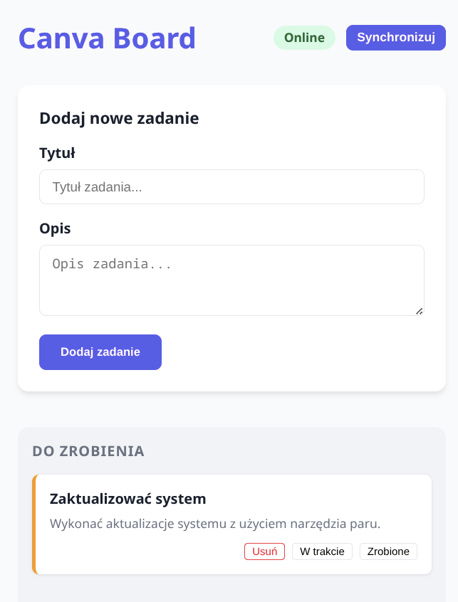
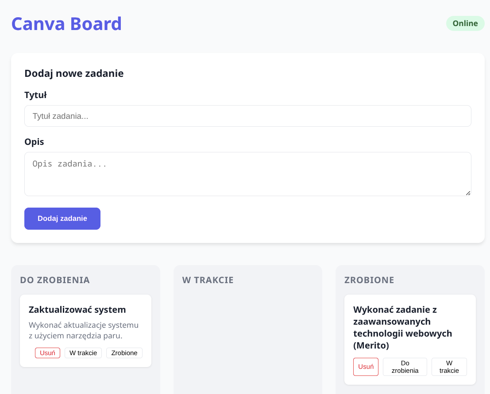

# Zadanie 3: Canva Board PWA z Worker Service i SQLite
Aplikacja typu Kanban Board (Canva Board) służąca do śledzenia postępów prac, wspierająca tryb offline oraz synchronizację danych, zbudowana w oparciu o Node.js, Express, SQLite i mechanizmy PWA.

## Działanie Aplikacji
1. **Zarządzanie Zadaniami (Online):**
   - Użytkownik może dodawać nowe zadania, określając ich tytuł i opis.
   - Zadania są kategoryzowane w trzech kolumnach: **Do zrobienia**, **W trakcie** oraz **Zrobione**.
   - Zmiana statusu zadania odbywa się poprzez przyciski nawigacyjne, co powoduje natychmiastową aktualizację w bazie SQLite na serwerze (poprzez REST API `PUT`).
2. **Tryb Offline i IndexedDB:**
   - Aplikacja automatycznie wykrywa brak połączenia internetowego (`navigator.onLine`).
   - W trybie offline nowe zadania są zapisywane lokalnie w przeglądarce przy użyciu bazy **IndexedDB**.
   - Zadania dodane offline są wizualnie wyróżnione (pomarańczowa krawędź), informując użytkownika o braku synchronizacji.
3. **Synchronizacja Danych:**
   - Po odzyskaniu połączenia, aplikacja wyświetla przycisk **"Synchronizuj"**.
   - Kliknięcie przycisku uruchamia proces przesyłania wszystkich lokalnie zapisanych zadań na serwer. Po pomyślnym zakończeniu, lokalna baza jest odświeżana danymi z serwera.
4. **Service Worker i PWA:**
   - `Service Worker` (`sw.js`) zarządza cache'owaniem plików statycznych (HTML, CSS, JS, ikony), umożliwiając załadowanie interfejsu aplikacji nawet bez dostępu do sieci.
   - Plik `manifest.json` pozwala na instalację aplikacji na pulpicie lub ekranie głównym telefonu jako natywnej aplikacji PWA.

## Użyte technologie
- **Backend:** `Node.js`, `Express.js`, `TypeScript`
- **Baza danych (Serwer):** `SQLite`
- **Baza danych (Klient):** `IndexedDB` - do przechowywania danych w trybie offline bezpośrednio w przeglądarce.
- **Frontend:** Vanilla JS/TS, CSS

## Jak uruchomić
```bash
npm install
npm run build
npm run dev:server
```
> Otwórz `localhost:3000` w przeglądarce aby zobaczyć interfejs aplikacji.

## Zdjęcia dzałającej aplikacji
 
 
 
 

### Wnioski
- Aplikacja poprawnie realizuje założenia PWA, pozwalając na pracę bez dostępu do sieci.
- Mechanizm mapowania `localId` pozwolił na uniknięcie konfliktów kluczy głównych przy synchronizacji z bazą SQLite.
- Integracja Service Workera zapewnia szybkie ładowanie zasobów dzięki strategii Cache-First dla plików statycznych.

---
Check repository branches to see specific lessons.
All (per lesson) source files were written/tested using:
> Operating System: CachyOS Linux (Wayland session) <br>
> Kernel Version: 6.19.3-2-cachyos (64-bit) <br>
> Processor: 16 × AMD Ryzen 7 PRO 5850U with Radeon Graphics <br>
> Memory: 24 GiB of RAM
>
> NodeJS 25.6.1 <br>
> NPM 11.10.1