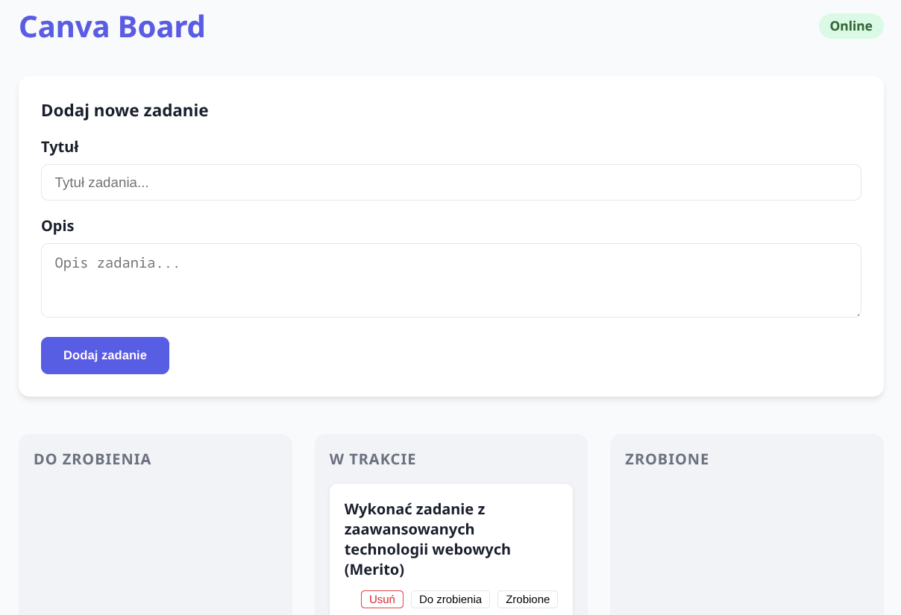
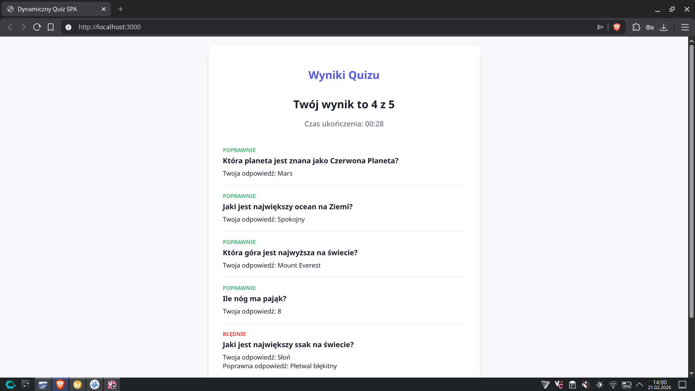

# Zadanie 1: Dynamiczny Quiz SPA

## Funkcjonalności
- **Losowe pytania**: System losuje 5 pytań z listy przy każdym uruchomieniu.
- **Timer**: Użytkownik ma 2 minuty na rozwiązanie całego quizu.
- **Responsywny Design**
- **Podsumowanie wyników**: Po zakończeniu quizu wyświetlany jest wynik, czas przejścia oraz szczegółowa lista poprawnych i błędnych odpowiedzi.

## Technologie
- **Backend**: Node.js + Express (obsługa API i serwowanie plików).
- **Frontend**: HTML5 + CSS3 + JavaScript.
- **Narzędzia**: TypeScript, NPM, concurrently.

## Jak uruchomić
```bash
npm install
npm run dev
```
> Otwórz `localhost:3000` w przeglądarce aby zobaczyć interfejs aplikacji.

## Zdjęcia dzałającej aplikacji
 
 

Check repository branches to see specific lessons.
Each lesson has task, check task.pdf file (written in Polish) to see details.

All (per lesson) source files were written/tested using:
> Operating System: CachyOS Linux (Wayland session) <br>
> Kernel Version: 6.19.3-2-cachyos (64-bit) <br>
> Processor: 16 × AMD Ryzen 7 PRO 5850U with Radeon Graphics <br>
> Memory: 24 GiB of RAM
>
> NodeJS 25.6.1 <br>
> NPM 11.10.1